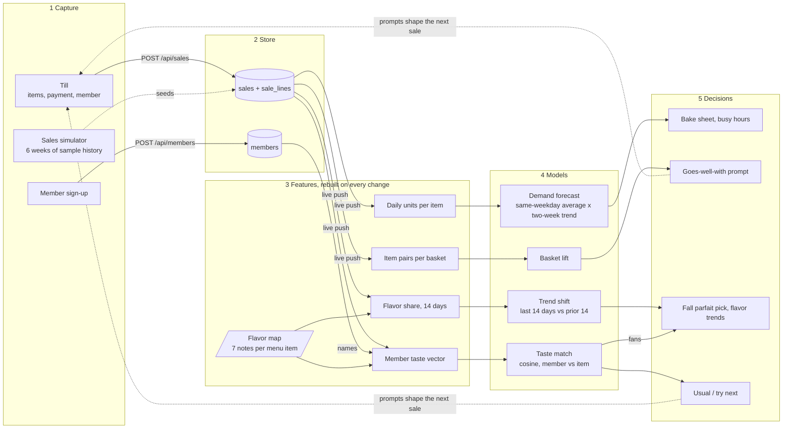

# Grandma's Till

A simulated till for a parfait and pastry shop. Every sale is saved to a database the moment it is charged, and the same records drive a bake-sheet forecast, combo suggestions, flavor trends and a taste profile for each member.

## Run it

```bash
node server.js
```

Then open <http://localhost:3000>. That is the whole setup: there is nothing to install.

- Needs Node 18 or newer (`node --version`).
- On Node 22.13+ the store is SQLite at `data/till.db`. On older Node the same records go to `data/till.json`. The startup line says which one you got.
- The server prints a `Phones:` address. Open it on a phone on the same Wi-Fi to use the till there while a laptop shows Insights. Sales appear on every open screen within a second.
- `npm run dev` restarts the server whenever `server.js` changes.
- `npm run reset` wipes till sales and signed-up members and starts fresh.
- `PORT=4000 node server.js` uses another port.

On start the server seeds six weeks of simulated sales and 40 sample members so the forecasts have something to learn from. Sales you ring up are stored alongside them with `src = 'till'`.

## What is where

| File | What it does | Change it when |
|---|---|---|
| `server.js` | HTTP server, REST API, database, live push | adding endpoints or changing storage |
| `public/core.js` | Menu, sales simulator, feature building, the four models. Loaded by the page **and** the server | changing the menu, prices or any maths |
| `public/app.js` | The four screens: Till, Members, Insights, Data flow | changing what a screen shows or does |
| `public/style.css` | All styling, light and dark | changing how it looks |
| `public/index.html` | Page skeleton and the data-flow diagram | adding a panel or tab |
| `data/` | The database. Created on first run, never committed | never by hand |

## API

| Method and path | Does |
|---|---|
| `GET /api/health` | Says the server is up and which store it uses |
| `GET /api/sales` | Every sale. Add `?src=till` to leave out simulated history |
| `POST /api/sales` | Saves a sale. Body: `{"lines":[{"id":"croissant","q":2}],"pay":"card","m":"m1004"}`. The server sets the time and looks up prices itself |
| `DELETE /api/sales` | Removes till sales, keeps simulated history |
| `GET /api/members` | Every member |
| `POST /api/members` | Signs up a member. Body: `{"name":"Rosa"}` |
| `GET /api/insights` | Tomorrow's bake sheet, forecast accuracy, pairs, flavor trends, fall parfait ranking |
| `GET /api/events` | Live stream of new sales and members (server-sent events) |

Try it without the page:

```bash
curl -X POST localhost:3000/api/sales -H 'Content-Type: application/json' \
  -d '{"lines":[{"id":"croissant","q":1},{"id":"latte","q":1}],"pay":"card"}'
curl localhost:3000/api/insights
```

## Database

Three tables.

```sql
sales      (id, ts, total, pay, member_id, src)     -- one row per sale; src is sim, till or rush
sale_lines (sale_id, item_id, qty, price)           -- one row per item on a sale
members    (id, num, name, joined, sample)
```

If you have the `sqlite3` command line tool you can query it directly while the server runs:

```bash
sqlite3 data/till.db "SELECT item_id, SUM(qty) AS sold FROM sale_lines GROUP BY item_id ORDER BY sold DESC;"
sqlite3 data/till.db "SELECT src, COUNT(*), ROUND(SUM(total), 2) FROM sales GROUP BY src;"
```

## Data flow



The models run in the browser after every sale. The server loads the same `core.js` to answer `/api/insights`, so both always agree.

## Two-minute demo

1. **Till.** Tap a croissant. The receipt suggests a latte, with the reason. Type `1004` in Member: the till shows Noah's usual and what he might love. Charge.
2. **Insights** on a second screen. Sales today ticks up as the charge lands. Press *Simulate a rush* on the Till and watch the numbers move.
3. **Bake sheet.** Tomorrow's quantities per item, and the accuracy check underneath.
4. **Members.** Open the member you just served: their taste profile already includes that sale.
5. **Data flow.** The diagram, and the exact record the database holds for the last sale.

## Get the code

This project lives in the [socratica-hackathon-2026](https://github.com/writingindy/socratica-hackathon-2026) repository alongside the other hackathon projects. Don't run `git init` in this folder: commit and push from the repository as a whole.

Ask the repository owner to add you under **Settings → Collaborators**, then:

```bash
git clone https://github.com/writingindy/socratica-hackathon-2026.git
cd socratica-hackathon-2026/grandmas-till
node server.js
```

Everyone gets their own local database, because `data/` is ignored by git.

## Working as a team

Split by file so two people rarely touch the same lines.

| Lane | Owns | Typical work |
|---|---|---|
| Backend | `server.js` | endpoints, storage, deployment |
| Models | `public/core.js` | menu and prices, forecast, taste matching, new insights |
| Screens | `public/app.js`, `public/style.css`, `public/index.html` | till flow, panels, polish |
| Pitch | `README.md` | demo script, description, diagram |

Rules that keep a short hackathon moving:

- `main` always runs. Before you push, start the server and click through the till once.
- Pull before you start anything: `git pull --rebase`.
- Small commits, pushed often. For anything risky use a short branch (`git switch -c till/forecast-tweak`; branch names start with the project name) and merge it within the hour.
- If you need to change a file in someone else's lane, tell them first. That one habit prevents most merge conflicts.
- One laptop is the demo machine. Stop changing it 20 minutes before the deadline and rehearse on it.

## Putting it online

- **Full version.** Any host that runs Node works: point it at this repository, set its **Root Directory** to `grandmas-till`, and use the start command `node server.js`. The server reads the port from `PORT`. On many free tiers the disk is wiped on restart, so till sales would be lost while the sample history reseeds itself.
- **Page only.** The `public/` folder also works on a plain static host. With no server to talk to, the page simulates the same history itself and keeps new sales in the visitor's browser, so nothing is shared between devices.

## What is simulated

The menu, prices, flavor scores, six weeks of sales, the 40 sample members and the five fall parfait ideas are all sample data. The forecast accuracy shown on Insights is measured on that simulated history, so it shows the method works on data with weekday patterns. It does not say how accurate it would be on a real shop's sales.
